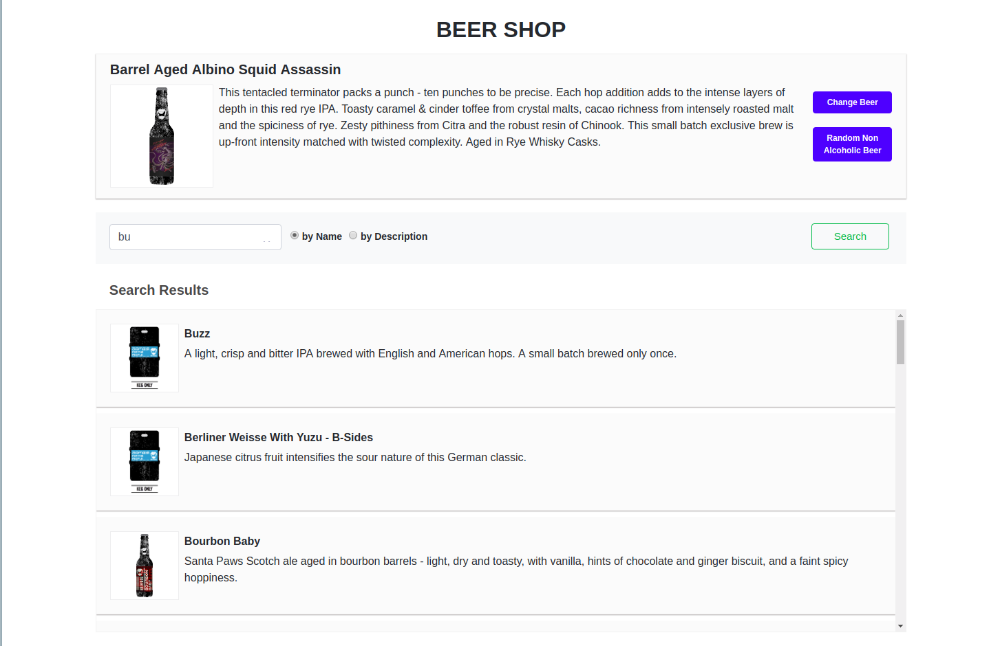

# BEER SHOP
Is an initial web page for beer e-commerce. You can find the default beer which is randomly chosen and allowed to change, also facilitate to chose the non-alcoholic beer. User can also search for the beer by its name or description.

### Languages used:
 **Client**
   - HTML
   - CSS
   - AngularJS (1.3)

 **Server**
   - NodeJS

 **Automation**
   - Protractor (automation)
### Setup:
<pre>
  Install node if you haven't.
  npm install  #install node modules
</pre>

### Run UI:
<pre>
  node server
</pre>

E2E automated testing, you can check [e2e directory](https://github.com/nimmisundarraj/beer-challenge/tree/master/e2e) for more info.