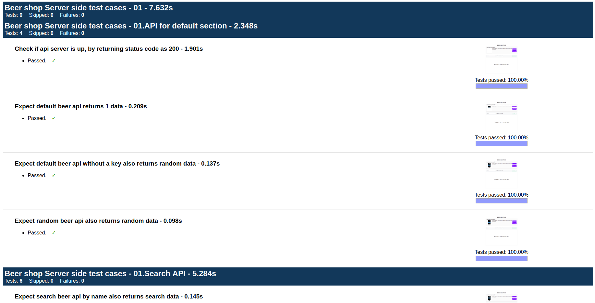
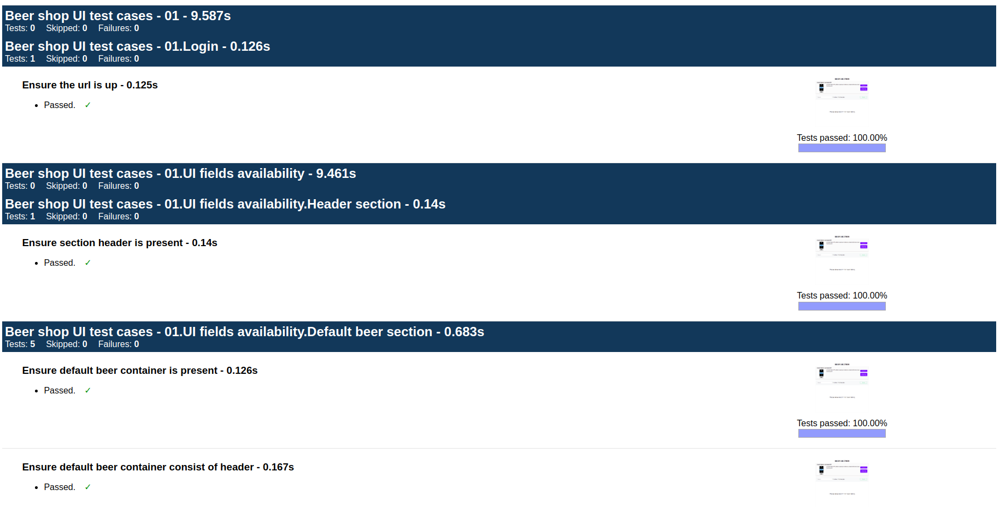

# Automated Tests using Protractor (Server / Client)

Protractor is an end-to-end test framework for Angular and AngularJS applications.
It is a Node.js program built on top of WebDriverJS.
It runs tests against your application running in a real browser, interacting with it as a user would.

### Set up:
Install protractor globally using npm:
<pre>
npm install -g protractor // My local have version 5.3.0
</pre>

Update webdriver-manager using:
<pre>
webdriver-manager update // My local have version 12.0.6
</pre>

### Set up:
<pre>
npm install
</pre>

### Run Test case:
<pre>
protractor conf.js
</pre>

**View Test Report:**
Ensure that you have the directory with all access permitted in /var/reports/e2e, or else you could change the path in conf.js.

